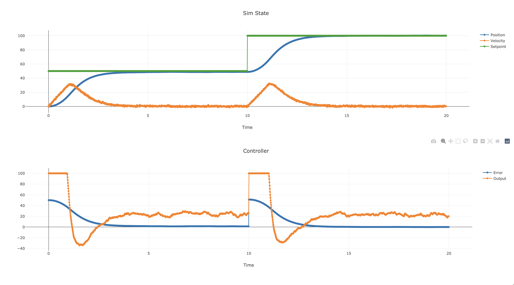

# Interview Option 1

### Requirments
- The craft must be able to hover within a reasonable error, you can decide what that means.
  - In this bounded test; Reasonable error was to maintain utmost stability with minimal osicillatory modes; Due to too many unknowns it's a bit out of reason to continue fine tuning precision.
- You must document what you are doing in the source code with comments, and be prepared to explain your design, tradeoffs, and whatnot.
  - The code is commented and attemtping to be as self explanatory as possible.
- You must include a way of visualizing the vehicle, this could be a graph, an animation, or anything you can think of.
  - I built this out of the provided `const_throttle` example, upon running that example a web browswer should open providing a plotly plot of the resulting simulation
- Ensure you use Git as you would in a real project. Commit often, we are here to see your process.
- Please outline how you tested your code. This could be manual testing, automatic testing, or something in-between.
  - This code was tested in the loop of an integration example manually; Tuning was also done manually via observation of the plots and years of anecdotal experience, along with simple bracketing until performance was reasonable. Tuning began with P only then PD, then PID terms.
  
### Example output

